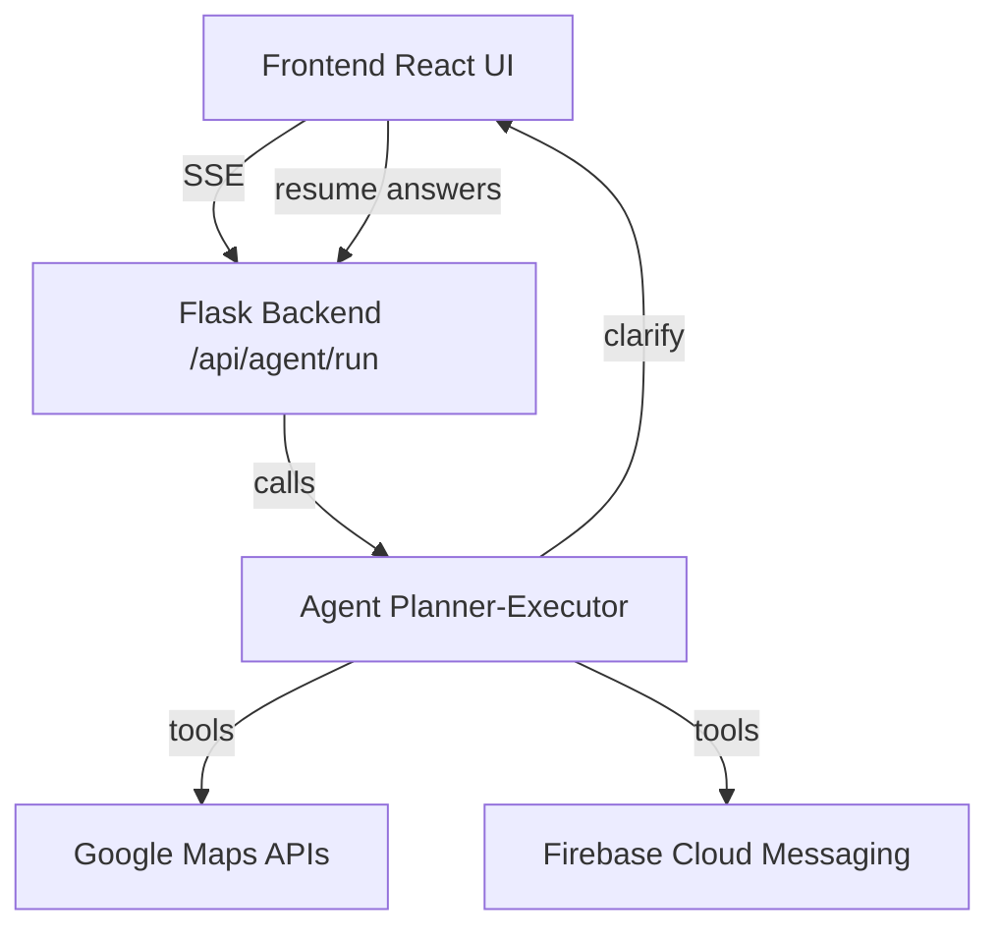

# 🚖 GrabHack – Real-Time Agentic Last-Mile Coordinator

GrabHack is an end-to-end prototype that demonstrates how **AI agents, real-time streams, and Google APIs** can coordinate last-mile delivery scenarios. It simulates real-world cases like package disputes, restaurant delays, and recipient unavailability, while keeping the customer, driver, and merchant informed via **push notifications and clarification flows**.

---

## ✨ Features

* **Agentic Orchestration**
  AI agent resolves delivery scenarios step-by-step using a planner–executor loop.

* **Interactive Clarification**
  Agent pauses to ask human input (e.g., “Safe drop allowed?”, “Choose alternate restaurant”).

* **Push Notifications via FCM**
  Driver, passenger, and customer receive live updates.

* **Google Maps / Places Integration**

  * 📍 Nearby parcel lockers (`places:searchNearby`)
  * 🍴 Nearby restaurants (`place/nearbysearch`)
  * 🚦 Traffic-aware ETAs (`directions` with traffic model)
  * 🗺️ Embedded maps with pins and directions

* **Frontend (React + Vite)**

  * `AgentStream` component renders live steps (SSE).
  * Clarification UI with buttons / file uploads.
  * Interactive maps (`StepEmbedMap`, `MerchantMap`, `AltRoutesMap`).

* **Backend (Flask + Python)**

  * `/api/agent/run` → SSE endpoint for agent streams.
  * `/api/agent/clarify/continue` → resumes sessions after input.
  * `/api/evidence/upload` → handle image evidence (e.g. damage disputes).
  * Tool functions (`tool_find_nearby_locker`, `tool_get_nearby_merchants`, `tool_check_traffic`, …).

---

## 🏗️ Architecture



---

## ⚙️ Tech Stack

* **Frontend**: React, Vite, Tailwind, Firebase Messaging SDK
* **Backend**: Flask (Python 3.11), SSE streaming
* **External APIs**:

  * Google Maps Places, Directions, Embed
  * Firebase Cloud Messaging (push)

---

## 🚀 Getting Started

### 1. Clone & Install

```bash
git clone https://github.com/yourname/grabHack.git
cd grabHack
```

**Backend (Flask):**

```bash
cd synapseFlask
pip install -r requirements.txt
python app2.py
```

**Frontend (React/Vite):**

```bash
cd synapse-frontend
npm install
npm run dev
```

---

### 2. Configuration

Create `.env` files for **both frontend and backend**.

**Backend (`synapseFlask/.env`):**

```
GOOGLE_MAPS_API_KEY=your_google_maps_api_key
FCM_SERVER_KEY=your_firebase_server_key
SECRET_KEY=your_flask_secret
```

**Frontend (`synapse-frontend/.env`):**

```
VITE_API_BASE=http://localhost:5000
VITE_FIREBASE_API_KEY=your_firebase_api_key
VITE_FIREBASE_PROJECT_ID=your_project_id
VITE_FIREBASE_SENDER_ID=your_sender_id
```

---

### 3. Firebase Setup

* Enable **Cloud Messaging** in your Firebase project.
* Add `firebase-messaging-sw.js` at project root (frontend).
* Update `lib/firebase.js` with your project credentials.

---

### 4. Google Maps Setup

Enable the following APIs in [Google Cloud Console](https://console.cloud.google.com/):

* Maps JavaScript API
* Places API
* Directions API

Restrict your API key to `http://localhost:*` for local testing.

---

## 💡 Example Scenarios

1. **Recipient Unavailable**

   * Agent asks: *“Safe drop okay?”*
   * If **No**, suggests nearest lockers.
   * User chooses a locker → FCM notification: *“Order placed in Mylapore H.P.O”*.

2. **Merchant Capacity (Delay)**

   * Customer notified of long prep time + voucher.
   * Driver rerouted.
   * Alternate restaurants fetched (e.g., *KFC, MILKYWAY*).
   * User chooses or rejects → push update sent.

3. **Damage Dispute**

   * Collects photos from driver & customer.
   * Analyzes evidence (merchant vs transit fault).
   * Issues resolution fairly.

---

## 🖼️ UI Highlights

* **AgentStream Timeline**: step-by-step reasoning with map previews.
* **Clarification Panel**: yes/no buttons, text inputs, or option lists.
* **Map Rendering**:

  * Directions (Google Embed).
  * Nearby restaurants/lockers with red pins.
  * Alternative routes overlay.

---

## 📂 Project Structure

```
grabHack/
├── synapseFlask/               # Flask backend
│   ├── app2.py                 # main API + agent loop
│   ├── tools/                  # tool functions (Google, FCM)
│   └── ...
├── synapse-frontend/           # React frontend
│   ├── src/components/AgentStream/
│   │   ├── AgentStream.jsx
│   │   ├── StepItem.jsx
│   │   ├── MerchantMap.jsx
│   │   └── ...
│   ├── lib/firebase.js
│   └── ...
└── README.md
```

---

## 🧪 Development Notes

* SSE streams close with `[DONE]`.
* Clarify flow uses `/api/agent/clarify/continue`.
* Hints (`lockers`, `merchants`, `answers`) are cached per session.
* Maps may break if API key is invalid or not enabled for correct APIs.

---

## 🔮 Future Improvements

* Switch to **AdvancedMarkerElement** (Google Maps update).
* Add **ETA estimation** with Routes API.
* Multi-lingual clarifications.
* Deploy on **Vercel (frontend)** + **Render/AWS/GCP (backend)**.

